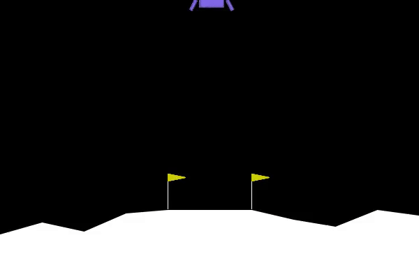

# hf-deep-rl
This repo contains code that I wrote while learning Deep Reinforcement Learning.

## [carpit680/ppo-LunarLander-v2](https://huggingface.co/carpit680/ppo-LunarLander-v2/tree/main/ppo-LunarLander-v2)

## [carpit680/ppo-Huggy](https://huggingface.co/carpit680/ppo-Huggy)
