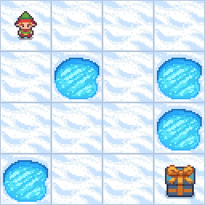
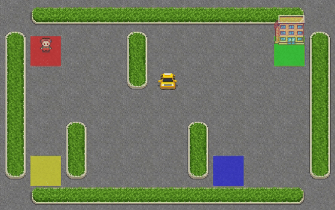
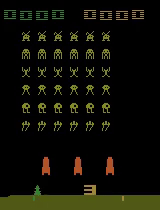

# hf-deep-rl

This repo contains code that I wrote while learning Deep Reinforcement Learning.

## [carpit680/ppo-LunarLander-v2](https://huggingface.co/carpit680/ppo-LunarLander-v2/tree/main/ppo-LunarLander-v2)

## [carpit680/ppo-Huggy](https://huggingface.co/carpit680/ppo-Huggy)

## [carpit680/q-FrozenLake-v1-4x4-noSlippery](https://huggingface.co/carpit680/q-FrozenLake-v1-4x4-noSlippery)

## [carpit680/q-Taxi-v3](https://huggingface.co/carpit680/q-Taxi-v3)

## [carpit680/dqn-SpaceInvadersNoFrameskip-v4](https://huggingface.co/carpit680/dqn-SpaceInvadersNoFrameskip-v4)
